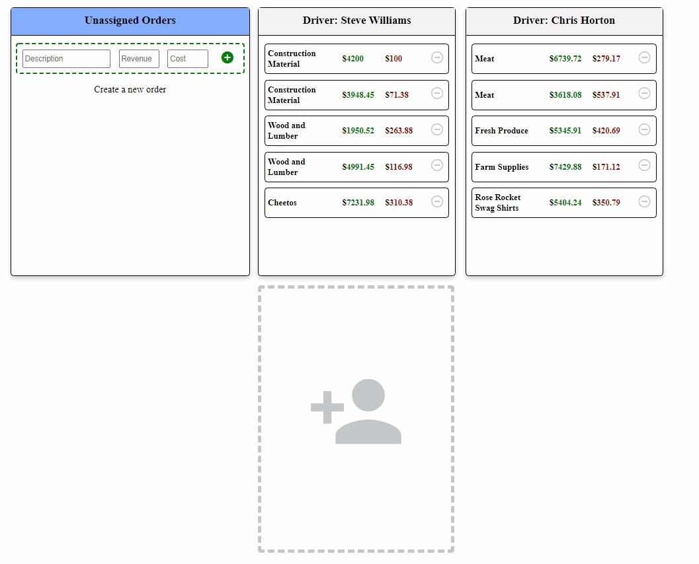

# Order Handler


### _The simplistic order & driver manager_


## 🗂️ Table of Contents
<ol>
  <li><a href="#about-the-project">About The Project</a></li>
  <li><a href="#getting-started">Getting Started</a></li>
    <ul>
      <li><a href="#Server-Installation">Server Installation</a></li>
      <li><a href="#Frontend-Installation">Frontend Installation</a></li>
    </ul>
  <li><a href="#Running-the-application">Running the application</a></li>
</ol>


## 📒 About The Project


Order-handler allows the user to create, edit and assign orders to existing drivers.
New drivers can be created and they can be deleted on the condition that they have no orders assigned to them.

### 👨‍💻 Tech stack


* this project used vue to build responsive and reusable componets
* for persistence storage (database) this web app used mongoDb. Two types of schemas are accepted (orders and drivers)
* NodeJs and ExpressJs are used to manage the backend of this project


## Getting Started


<a href="https://nodejs.org/en/"><b>Node</b></a> is required to run this program.

```sh
npm install -g npm
```

### Server Installation

The server is built using nodeJs.

Included dependencies:

```sh
express   cors  body-parser   mongodb   mongoose
```

To install all above dependencies, simply navigate into the server directory and run:

```sh
npm install
```


### Frontend Installation

Frontend is built using VueJs.
To install all required vue dependencies, run the following in the main project directory:

```sh
npm install
```


## Running the application

To start the server, navigate to the server directory and run the following on the terminal
```
npm run start
```

The server can be accesed on the following port

```sh
http://localhost:5000/
```

To build the frontend, run the following in the main directory terminal

```sh
npm run serve
```

The frontend should be accessible by default on:

```sh
http://localhost:8080/
```

