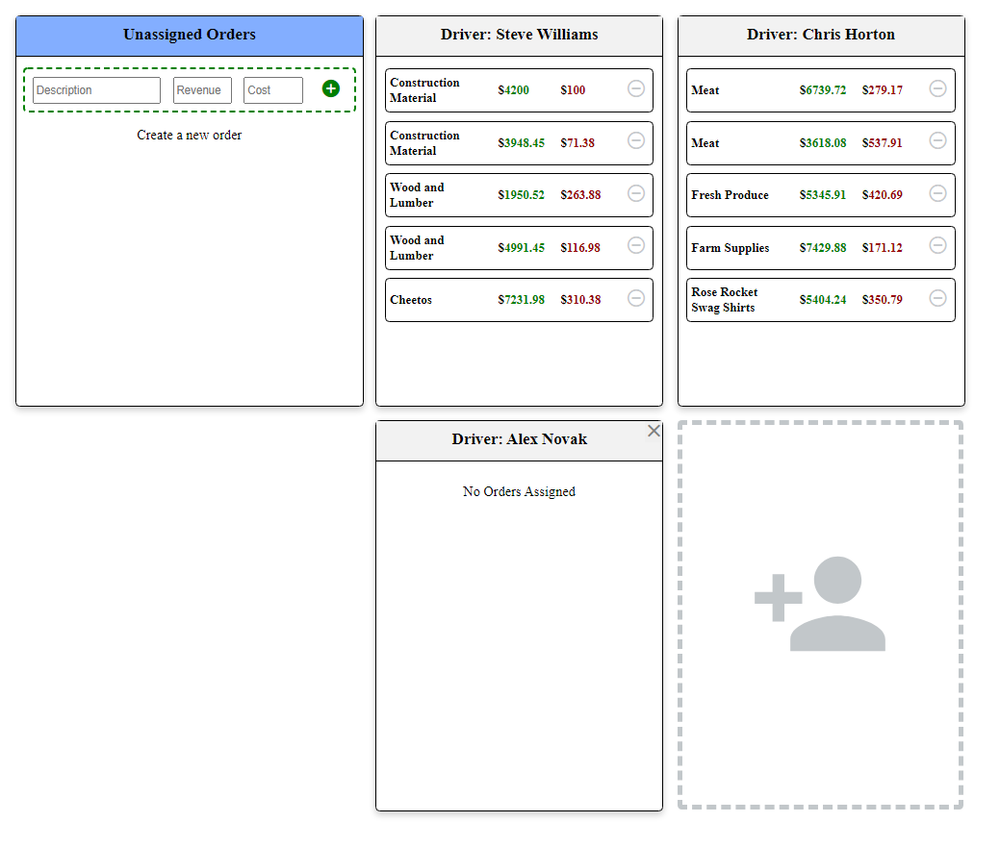

# Order Handler
### _The simplistic order & driver manager_

## 🗂️ Table of Contents
<ol>
  <li><a href="#about-the-project">About The Project</a></li>
  <li><a href="#getting-started">Getting Started</a></li>
    <ul>
      <li><a href="#Installation">Installation</a></li>
      <li><a href="#Running">Running</a></li>
    </ul>
  <li><a href="#acknowledgements">Acknowledgements</a></li>
</ol>


## 📒 About The Project


Order-handler allows the user to create, edit and assign orders to existing drivers.
New drivers can be created and they can be deleted on the condition that they have no orders assigned to them.

### 👨‍💻 Tech stack

- this project uses <a href="https://vuejs.org/"><b>Vue</b></a> to build responsive and reusable components
- For persistence storage (database) this web app uses mongodb, where two types are schemas are authorized to be stored (orders and drivers)
- NodeJs and ExpressJs are used to manage the backend of this project


## Getting Started


<a href="https://nodejs.org/en/"><b>Node</b></a> is required to run this program.

```sh
npm install -g npm
```

### Installation

#### server installation:

Navigate into the server directory and run
```sh
npm install
```
This will install all the dependencies for the server

#### frontend installation:

In the main project directory run
```sh
npm install
```
This will install all the dependencies required for the front end


### Running

To start the server, navigate into the server directory
```
npm run start
```
To start the build the frontend, run the following in the main directory terminal
```
npm run serve
```


